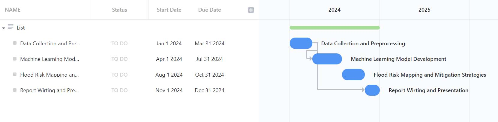
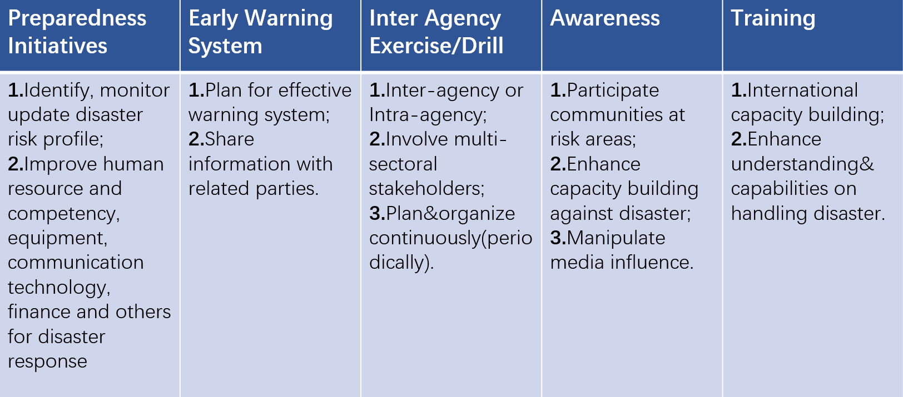

class: inverse, center, middle
```{r xaringan-themer, include=FALSE, warning=FALSE}
library(xaringanthemer)
style_mono_light(
  base_color = "#23395b",  
  #header_font_google = google_font("Josefin Sans"),
  #text_font_google   = google_font("Montserrat", "300", "300i"),
  #code_font_google   = google_font("Fira Mono")
  title_slide_background_image = "img/pic2.jpeg"
)
```

```{r echo=FALSE, message=FALSE, warning=FALSE}
library(knitcitations)
library(RefManageR)
BibOptions(check.entries = FALSE,
           bib.style = "authoryear",
           cite.style = "authoryear",
           style = "markdown",
           hyperlink = TRUE,
           dashed = FALSE,
           no.print.fields=c("doi", "url", "urldate", "issn"))
myBib <- ReadBib("./EarthSight.bib", check = FALSE)
```

# Outline


### 1. Context and Regulation

### 2. Workflow and Methodology

### 3. Project Management Overview

### 4. Conclusion

### 5. References

---
<<<<<<< HEAD
# Context and Regulation
=======
## Context and Regulation (Farhan)
- Worst floods in the past 30 years have occurred from 2003 onwards. The majority of natural disasters from 1998 to 2018 were natural disasters (38/51).

- Malaysia had the highest percentage (67%) of the population exposed to floods among ASEAN Member States (between July 2012 and January 2019) as reported by ASEAN Coordinating Centre for Humanitarian Assistance on disaster management in March 2019.

- Nine percent of land area in Malaysia is flood prone and 4.8 million people live in areas at risk to flood.

- Monsoon and flash floods are the primary climate related natural disasters in the country.

- Malaysia’s flood prone area covers approximately 29 km and affects more than 4.82 million people.

- Additionally, annual damage caused by floods has cost an annual US $4.82 million.
>>>>>>> 3d019afb21c76e601c891106f85167b38ee3b332
---
# Problem statement

- Malaysia had the highest percentage (67%) of the population exposed to floods among ASEAN Member States (between July 2012 and January 2019) as reported by ASEAN Coordinating Centre for Humanitarian Assistance on disaster management in March 2019.

- Monsoon and flash floods are the primary climate related natural disasters in the country.

- Nine percent of land area in Malaysia is flood prone and 4.8 million people live in areas at risk to flood.

- Worst floods in the past 30 years have occurred from 2003 onwards. The majority of natural disasters from 1998 to 2018 were natural disasters (38/51).

- Over the past 3 years, Malaysia has suffered from the heaviest floods in its history in over 2 decades, affecting states all across the nation.
---

#Flood Impacts

###Social 
- Tens of thousands suffer from population displacement annually. Lives have also been lost.

###Economic
- 

###Environmental
- 
---
# Location Selection: Why Kuala Lumpur?
- Malaysia's capital city 
- Serves as the economic centre of Malaysia alongside the neighbouring state of Selangor
- Is the most complete infrastructure-wise, will act as a benchmark for other states in terms of development goals
---
# Malaysia's Disaster Risk Reduction Framework
---
# Research Questions
---
# Gaps Identified Within Current Framework
--- 
# Aims of Proposal

- to provide a more comprehensive disaster response mechanism using current remotely sensed methods
- to ensure alignment of data-driven methods for disaster risk mitigation in line with goals set by ratified international agreements (COP26, SDG goals, C40 cities)
- to identify gaps for integration of proposed methods to existing disaster risk framework
- to expand accessibility of findings beyond disaster response to be used by all relevant ministries
- 

--- 
## Workflow and Methodology (Tongmeng and Zirui)

---
## Flood risk management —— Flood prediction
### Overview
| Data Pipeline Step | Description |
| --- | --- |
| Data Collection | Obtain geo-environmental data of Exeter, including elevation, slope, soil type, substrate, land cover, NDVI, land use, imperviousness, distance to river, and distance to road |
| Preprocessing | Use QGIS to project all maps into an EPSG:27700 projected coordinate system for the United Kingdom, convert vector maps into raster maps, extract the clip of maps by mask layer based on the boundary of Exeter from an administrative division map of England, resample and set the resolution as 1 m, and convert data to numerical data from raster images with a grid size of 10 m using Rasterio tool |
| Feature Selection | Use multicollinearity diagnosis test to prevent inputting similar features into the models and save training time and computation power. All features with VIF less than 10 are applied to train NB, perceptron, ANN, and CNN models |
| Data Balancing | Use oversampling and undersampling methods to balance the data, as the distribution of flood risks is extremely imbalanced. Non-flood areas account for about 98%, 95%, and 90% for 30-year, 100-year, and 1000-year flood events. Level 4 risk areas only account for 0.01% and 0.06% for 30-year and 100-year flood events, respectively |
| Model Selection and Assessment | Apply NB, perceptron, ANN, and CNN models to assess the flood risk of 30-year, 100-year, and 1000-year flood events. Evaluate model performance using appropriate metrics |
---
## Flood prediction
### Metrics
Accuracy, F-beta score, and receiver operating characteristic (ROC) curve, as well as the oversampling and undersampling techniques used to address the issue of data imbalance. 
---
## Flood prediction
### What do we mean by accuracy:
@
---
## Assessing flood damage
### Overview
Considering that Malaysia does not have enough datasets for analyzing, in this case, we need to make sure that the datasets that we owned can satisfy the methodology we select.  

Under this circumstance, we decide to use night light and census data to evaluate the number of people affected. The process is divided into three major steps: data pre-processing, model building and assessment.
---
## Assessing flood damage
### Work flow
```{r echo=FALSE, out.width='90%',fig.align='center',fig.cap='flow chart'}
knitr::include_graphics('night/flow.png')
```

---
## Assessing flood damage
### Data pre-process

```{r, load_refs, include=FALSE, cache=FALSE}
library(RefManageR)
BibOptions(check.entries = FALSE,
           bib.style = "authoryear",
           cite.style = "authoryear",
           style = "markdown",
           hyperlink = TRUE,
           dashed = FALSE,
           no.print.fields=c("doi", "url", "urldate", "issn"))
myBib <- ReadBib("./EarthSight.bib", check = FALSE)
```

* First, the NPP-VIIRS night-light remote sensing data were resampled to 500m × 500m based on the administrative map with image cropping, Albers projection and nearest neighbor interpolation, and the negative areas were assigned a value of 0. 

* Using the statistical volume method of radiation normalization to reducing the impact of cloud cover on night-light remote sensing imagery `r Citet(myBib, "heFloodDamageAssessment2022")`.
---
## Assessing flood damage
### Building model

Light index can indicate the dynamics population and economic development. To be specific, light density can represent the density of population, light area can represent the distribution of population, the tendency of urban expansion `r Citet(myBib, "heFloodDamageAssessment2022")`.

---
## Assessing flood damage
### Building model
$$LD=(1/N)\sum_{i = 1}^{i=n}D N_{i}$$ 
$$LA=\sum{i}, D N_{i}>1 $$ 

In the formula, $LD$ is the average of light density, $LA$ is the area of light and $DN_{i}$ is the brightness of pixel.

$$y=a\times R_{VIIRS} + b$$ 
$$y=a\times R_{VIIRS}^{2} + b\times R_{VIIRS} + c$$ 

$y$ is population related parameters, $R_{VIIRS}$ is NPP-VIIRS night light brightness radiation value, a, b, c are constant items.

$$P_{E}=\rho_{e} \times A_{e}$$ 

$P_{E}$ is the total affected population; $rho_{e}$ is the population density of the affected area; $A_{e}$ is the affected area.

---
## Assessing flood damage
### Assess model
Before and after the flood, the brightness of the lights changed significantly, and the damage of power lines, the collapse of buildings and evacuation of people caused the brightness of the lights to decrease significantly.

In that case, by comparing the images of light between before disaster and after disaster we can get the information of the disappear of light. Based on above formula and information, we can estimate how many people suffer the disaster and economic losses as well.

---
class: inverse, center, middle

#But how do we evaluate the accuracy of our model?#

---
## Assessing flood damage
### Assess model

Before we apply we model, we can estimate the number of people firstly by using the before disaster's image and access the accuracy of our model.

$$RE=\frac{R_{e}-R_{s}}{R_{s}}\times100\%$$ 

$R_{e}$ is the population of estimate, and $R_{s}$ is the ture value of population.

| Relative margin of error | Level of accuracy  |
| --- | --- |
|> 50%| High   |
| 25% ~ 50% | Medium |
|< 25% | Low    |

---
class: inverse, center, middle
# Project Management Overview 

```{r echo=FALSE, out.width='50%',fig.align='center',fig.cap='flow chart'}
knitr::include_graphics('img/pm1.png')
```
---
# Outline of Project Management 

.pull-left[
### 1. Phases
### 2. Project Plan
### 3. Risks and Mitigative Actions
### 4. Timeline
### 5. Resource Allocation
### 6. Value for Money

]

.pull-right[
```{r echo=FALSE, out.width='80%', fig.align='center'}
knitr::include_graphics('img/pm2.png')
```
]
---
## Project Management - Phases

```{r echo=FALSE,fig.align='center'}

```
---
## Project Management - Preparedness

```{r echo=FALSE, out.width='90%', fig.align='center'}

```

---
## Project Management - Project Plan (1)
1. Project initiation and stakeholder engagement (Month 1)
  - Develop project charter 
  - Identify and engage with stakeholders 
  - Establish project governance structure 
  
2. Data Collection and Analysis (Month 2-5)
  - Collect relevant data, including night light data, satellite imagery, digital elevation models, and flood maps.
  - Preprocess the data to ensure that it is compatible with our analytical methods.
  - Develop machine learning models, including naïve Bayes, perceptron, artificial neural networks (ANNs), and convolutional neural networks (CNNs).
  - Train and evaluate the models using appropriate statistical metrics.
  - Analyze historical flood data 


---
## Project Management - Project Plan (2)

3. Flood Risk Mapping and Mitigation Strategies (Month 6-8)
  - Develop a comprehensive flood risk management plan 
  - Produce flood risk maps using the machine learning models and interpret the results.
  - Identify areas that are most vulnerable to flooding and propose potential mitigation strategies.
  - Building flooding monitoring and early warning systems 
  - Building flooding forecasting system 
  
4. Report Writing and Presentation (Month 9-10)
  - Write a comprehensive report detailing the methodology and findings of the study.
  - Prepare a presentation to share the results and recommendations with stakeholders.
  
5. Monitor and Evaluate Effectiveness of Strategies 
  - Establish a monitoring and evaluation framework 
  - Conduct regular evaluations of the implemented strategies 
  - Provide recommendations for improvements 
  - Damage assessment 
---
## Project Management - Risks and Mitigative Actions

.pull-left[
1. Data Quality: There is a risk that the quality of the remote sensing data may be suboptimal, leading to inaccuracies in our analysis. To mitigate this risk, we will carefully evaluate the credibility of our data sources and conduct thorough quality checks during data preprocessing.
2. Model Accuracy: There is a risk that the machine learning models may not accurately predict flood risk in Malaysia. To mitigate this risk, we will use appropriate statistical metrics to evaluate the accuracy of our models and adjust them as necessary.
3. Stakeholder Engagement: There is a risk that stakeholders may not be receptive to our findings and recommendations. To mitigate this risk, we will engage with stakeholders throughout the project and ensure that our results are communicated clearly and effectively.
]

.pull-right[
```{r echo=FALSE, out.width='80%', fig.align='center'}
knitr::include_graphics('img/risk.png')
```
]
---
## Project Management - Timeline
---
## Project Management - Resource Allocation (1)
.pull-left[
- Project Manager: The project manager will oversee the entire project and will be responsible for the successful delivery of the project. They will need to have project management skills, experience in flood risk management, and excellent communication skills to engage with stakeholders. They will allocate 100% of their time to this project. 

- Data Analyst: The data analyst will be responsible for collecting and analyzing earth observation data, identifying areas with high flood risk, and developing flood extent mapping. They will allocate 100% of their time to this project. 

]
.pull-right[
```{r echo=FALSE, out.width='70%', fig.align='center'}
knitr::include_graphics('img/manager.png')
```
]

---
## Project Management - Resource Allocation (2)
.pull-left[
```{r echo=FALSE, out.width='70%', fig.align='center'}
knitr::include_graphics('img/analyst.png')
```
]
.pull-right[
- Flood Risk Management Expert: The flood risk management expert will be responsible for developing and implementing flood risk management strategies, identifying and prioritizing flood mitigation measures, and conducting regular evaluations of the implemented strategies. They will allocate 100% of their time to this project. 

- Stakeholder Engagement Specialist: The stakeholder engagement specialist will be responsible for engaging with stakeholders, organizing workshops, and providing regular project updates. They will allocate 100% of their time to this project. 
]


---
## Project Management - Resource Allocation (3)
- Support Staff: Administrative support staff will be needed to provide assistance to the project manager and other project team members. They will allocate 20% of their time to this project. 

- Earth Observation Data Services Provider: A vendor specializing in earth observation data services will be required to provide technical support for the project. They will allocate 100% of their time to this project. 

- Flood Risk Management Consultants: External consultants with expertise in flood risk management will be engaged to support the flood risk management expert in developing and implementing flood risk management strategies. They will allocate 50% of their time to this project. 

```{r echo=FALSE, out.width='20%', fig.align='center'}
knitr::include_graphics('img/brain.png')
```
---
## Project Management - Value for Money
The total budget for this project is £500,000. To achieve value for money, we will ensure that all aspects of the project are efficient and cost-effective. We will prioritize the use of open-source software and free data sources wherever possible to minimize costs. Additionally, we will produce tangible and actionable outputs, such as flood risk maps and mitigation strategies, that can be incorporated into business as usual operations by the Malaysian government. By providing a valuable contribution to flood risk management in Malaysia, we believe that this project will be an excellent investment for the city.

```{r echo=FALSE, out.width='25%', fig.align='center'}
knitr::include_graphics('img/money.png')
```
---
## Conclusion

---
## References

