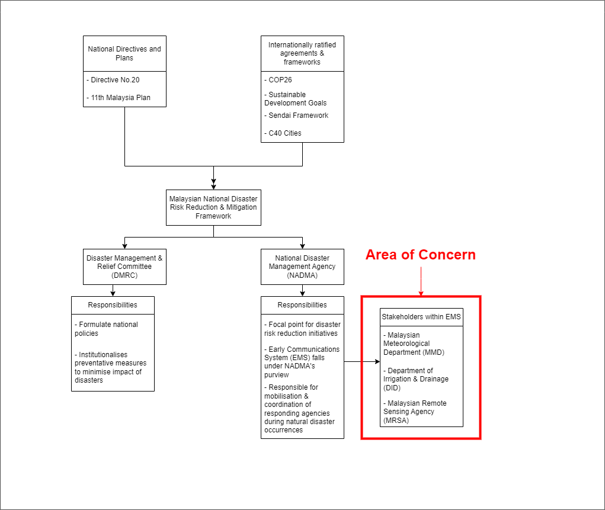

---
title: "Flood Risk Management Strategies for Kuala Lumpur, Malaysia"
subtitle: "⚔<br/>Group: EarthSight"
author: "Hansen Wiguna, Ahmad Farhan, Zirui Guo, Yao Wang, Tongmeng Xie"
institute: "University College London"
date: "2023/02/23 (updated: `r Sys.Date()`)"
output:
  xaringan::moon_reader:
    css: [xaringan-themer.css, custom.css]
    #css: [hygge-duke, duke-blue, uwm-fonts]
    lib_dir: libs
    nature:
      highlightStyle: github
      highlightLines: true
      ratio: 16:9
      countIncrementalSlides: false
---
class: inverse, center, middle
```{r xaringan-themer, include=FALSE, warning=FALSE}
library(xaringanthemer)
style_mono_light(
  base_color = "#23395b",  
  #header_font_google = google_font("Josefin Sans"),
  #text_font_google   = google_font("Montserrat", "300", "300i"),
  #code_font_google   = google_font("Fira Mono")
  title_slide_background_image = "img/pic2.jpeg"
)
```

```{r echo=FALSE, message=FALSE, warning=FALSE}
library(knitcitations)
library(RefManageR)
BibOptions(check.entries = FALSE,
           bib.style = "authoryear",
           cite.style = "authoryear",
           style = "markdown",
           hyperlink = TRUE,
           dashed = FALSE,
           no.print.fields=c("doi", "url", "urldate", "issn"))
myBib <- ReadBib("./EarthSight.bib", check = FALSE)
```

# Outline


### 1. Context, Existing Regulations, & Problem Definition

### 2. Approach Methodology & Output

### 3. Project Management Overview

### 4. Conclusion

### 5. References

---
class: inverse, center, middle


```{r echo=FALSE, message=FALSE, warning=FALSE}
library(knitcitations)
library(RefManageR)
BibOptions(check.entries = FALSE,
           bib.style = "authoryear",
           cite.style = "authoryear",
           style = "markdown",
           hyperlink = TRUE,
           dashed = FALSE,
           no.print.fields=c("doi", "url", "urldate", "issn"))
myBib <- ReadBib("./EarthSight.bib", check = FALSE)
```
# Context, Existing Regulations, & Problem Definition
---
# Malaysia's Disaster Risk Profile

- Malaysia had the highest percentage (67%) of the population exposed to floods among ASEAN Member States (between July 2012 and January 2019) as reported by ASEAN Coordinating Centre for Humanitarian Assistance on disaster management in March 2019.

- Monsoon and flash floods are the primary climate related natural disasters in the country.

- Nine percent of land area in Malaysia is flood prone and 4.8 million people live in areas at risk to flood.

- Worst floods in the past 30 years have occurred from 2003 onwards. The majority of natural disasters from 1998 to 2018 were natural disasters (38/51).

- Over the past 3 years, Malaysia has suffered from the heaviest floods in its history in over 2 decades, affecting states all across the nation.
---

#Flood Impacts

###Social 
- Tens of thousands suffer from population displacement annually. Lives have also been lost.

###Economic
- Damages and losses across different sectors (public infrastructure, housing, business premises, private vehicles, agriculture,) amounting to £113 million / USD138.8 million / RM622.4 million in 2022 alone.

- Certain states suffer from heavier losses than others, impacting economic output and weakening their ability to recover. 

###Environmental
- Exacerbates soil erosion, leading to an increase in landslides (another natural disaster Malaysia is prone to).
---
# Location Selection: Why Kuala Lumpur?
- Malaysia's capital city.

- Serves as the economic centre of Malaysia alongside the neighbouring state of Selangor (known as the Klang Valley). Damage to the federal territory and its surroundings impedes the country's economic output as most businesses are closest to the country's capital.

- KL is the most complete infrastructure-wise, will act as a benchmark for other states in terms of development goals.

We intend to introduce the proposed model across the rest of the Malaysian states if this preliminary project is deemed successful.
---
# Research Questions
- What is the current structure and practices in place to respond to natural disasters?

- What gaps can we identify within the aforementioned system?

- What current remote sensing methods are being used to acquire topographic information in Malaysia?

---
# Malaysia's Disaster Risk Reduction Framework
```{r echo=FALSE, out.width='50%',fig.align='center',fig.cap='flow chart'}

```
---
# Malaysia's Disaster Risk Reduction Framework
```{r echo=FALSE, out.width='50%',fig.align='center',fig.cap='flow chart'}

```
---
# Gaps Identified Within Framework/Problem Definition

- Insufficient data
  - Data is only sufficient enough for forecasting flood occurrence, not for the prediction of potential flood prone areas.

- Disjointed coordination between relevant stakeholders
  - Framework is reactive instead of proactive, relevant authorities mobilise resources only after disaster has taken place.
  
- Incomplete stakeholder involvement
   - Only disaster-related agencies are a part of the framework. Involvement should include all ministries affected by ramifications of natural disasters.
  
---
# Aims of Proposal
- To provide a more comprehensive disaster response mechanism using current remotely sensed methods.

- To ensure alignment of data-driven methods for disaster risk mitigation in line with goals set by ratified international agreements (COP26, SDG goals, C40 cities, Sendai Framework).

- To identify gaps for integration of proposed methods to existing disaster risk framework.

- To expand accessibility of findings beyond disaster response to incorporate involvement of all relevant departments and ministries.

---
class: inverse, center, middle
# Approach Methodology & Output
---


--- 
## Workflow and Methodology
- To make policies implementable

  - Need to propose real analysis workflow
  
  - Give prototypes illustrating how EO data and remote sensing can help
  
  - Fit the workflow into the flood solution
  
  - Work on the chaining of function modules and potential automisation of pipeline
  
- How can these facilitate minimising risks for people, governments and more

  - How are information gaps closed
  
  - How are losses prevented
  
  - Identify persisting risks
  
---

## Flood Forecasting - A Quick Review
### The old-fashioned way - Hydrological model 
Uses historical data on precipitation, runoff, and other factors to predict flood occurrences. 
Relies on physical equations and mathematical representations of the water cycle, e.g.:
- Continuity Equation Balances water storage (∆S) with inflow (I) and outflow (O): 
  \begin{equation}
    \Delta S = I - O
    \end{equation}
- Runoff Estimation: 
$$Q = (P - Ia)^2 / (P - Ia + S)$$
  Where
  - Q: direct runoff (depth)
  - P: direct runoff (depth) 
  - Ia: initial abstraction, representing the water intercepted by vegetation, infiltration, and surface storage
  - S: potential maximum retention (depth), depending on soil type, land use, antecedent moisture conditions
  
<div class="footnotes">
<small>
- Reference: US Army Corps of Engineers, Hydrologic Engineering Center. (n.d.). <a href="https://www.hec.usace.army.mil/software/hec-ras/" target="_blank">HEC-RAS</a>. 
</small>
</div>

---
### The old-fashioned way - Hydrological model 

Example of simulating watershed on a map of Digital Elevation Model (DEM)
- Continuity Equation 
  - Ensures the water balance
  - Tracks the flow of water (through e.g. surface water, soil moisture and groundwater)
- Runoff Estimation: 
  - quantifying the amount of water 

```{r  include=FALSE}
video_path  <- "vids/400SqMileWatershed.mpeg"
video_files <- list.files(video_path,
                         pattern = "\\.mp4$",
                         recursive = TRUE,
                         all.files = FALSE,
                         full.names = TRUE)
```
<video style="display: block; margin-left: auto; margin-right: auto; width: auto; height: auto;" autoplay>
<source src="vids/400SqMileWatershed.mpeg" type="video/mp4">
</video>


<div class="footnotes">
<small>
- Reference: US Army Corps of Engineers, Hydrologic Engineering Center. (n.d.). <a href="https://www.hec.usace.army.mil/software/hec-ras/" target="_blank">HEC-RAS</a>. 
</small>
</div>
---
### The old-fashioned way - Hydrological model 
DEM-based hydrological models 
- Identify low-lying areas and floodplains in the urban landscape that are more susceptible to flooding. 
- Inform decisions
  - Planners: Floodplain zoning and land-use planning ( flood-resistant land uses, such as parks and recreational areas, to flood-prone regions.)
  - Emergency response teams can prioritise levees and floodwalls construction in certain areas
  - Design evacuation plans to minimise casualties
```{r  include=FALSE}
video_path  <- "vids/400SqMileWatershed.mpeg"
video_files <- list.files(video_path,
                         pattern = "\\.mp4$",
                         recursive = TRUE,
                         all.files = FALSE,
                         full.names = TRUE)
```
<video width="1440" height="560" autoplay>
<source src="vids/400SqMileWatershed.mpeg" type="video/mp4">
</video>


<div class="footnotes">
<small>
- Reference: US Army Corps of Engineers, Hydrologic Engineering Center. (n.d.). <a href="https://www.hec.usace.army.mil/software/hec-ras/" target="_blank">HEC-RAS</a>. 
</small>
</div>
---
class: inverse, middle
# How Can Flood Prediction Help Kuala Lumpur: 


- ### How are information gaps closed

- ### How are losses prevented

- ### Identifying persisting risks

  
---
## Flood Risk Management - Flood Prediction
Significant Savings in Case Studies
- European Union's Floods Directive: €460 million saved in avoided damages (2006-2015)

- Iowa Flood Center: $96 million saved in flood damage costs (2010-2015)

- Flood Forecasting Centre (UK): £1.2 billion saved in potential damages (2009-2014)

<div class="footnotes">
<small>
References: - European Environment Agency (2016). Flood risks and environmental vulnerability ↩

- Demir, I., & Krajewski, W. F. (2016). Towards an information system for the socially vulnerable groups during flood disasters ↩

- <a href="https://uiowa.edu/" target="_blank"->Environment Agency and Met Office (2015). Flood Forecasting Centre Five Year Review 2009-2014</a>. 
</small>
</div>

---
### Machine-learning based prediction - A blackbox considering numerous factors

| Data Pipeline Step | Description |
| --- | --- |
| Data Collection | Collect geo-environmental data for Kuala Lumpur, including elevation, slope, soil type, substrate, land cover, NDVI, land use, imperviousness, distance to river, and distance to road |
| Preprocessing | Standardize maps using QGIS: project into EPSG:3168 coordinate system, convert vector to raster maps, clip to Kuala Lumpur boundaries, resample to 1m resolution, and convert raster images to numerical data with 10m grid size using Rasterio |
| Feature Selection | Perform multicollinearity diagnosis test to exclude similar features, reducing training time and computational power. Use features with VIF less than 10 in ANN models |
| Data Balancing | Balance data with oversampling and undersampling due to imbalanced flood risk distribution. Adjust non-flood areas (98%, 95%, 90% for 30-, 100-, and 1000-year events) and level 4 risk areas (0.01% and 0.06% for 30- and 100-year events) |
| Model Selection & Assessment | Apply NB, perceptron, ANN, and CNN models for 30-, 100-, and 1000-year flood events. Evaluate performance using suitable metrics |
---
## Flood prediction
### Metrics
Accuracy, F-beta score, and receiver operating characteristic (ROC) curve, as well as the oversampling and undersampling techniques used to address the issue of data imbalance. 
---
## Flood prediction
### What do we mean by accuracy:

```{r echo=FALSE, out.width='100%',fig.align='center',fig.cap=''}

```
---
class: inverse, center, middle


# Does Prediction Suffice?
---
## Is prediction enough for flood risk management?
### Pros and cons of ML-based flood prediction
| Pros | Cons |
| --- | --- |
| Mature tech-flow | Computation-intense |
| Promising accuracy | Prone to Data Flaws |
| Utilising ML/DL models | Cumbersome to deployment|
| Prediction Based on Abundant information | Data-expensive |
| Almost always generate outcome | But Untimely! |
---
class: inverse, center, middle
# Introducing Real-time Monitoring
---
## Flood risk management - real-time monitoring
### Synthetic Aperture Radar (SAR) for flood monitoring
- SAR: Active remote sensing technology that can penetrate clouds, operate day or night, and provide high-resolution imagery1

- Real-time flood monitoring: Timely and accurate information on flood extent, duration, and impact for emergency response and management

### Benefits of SAR-based flood monitoring
- Rapid assessment: Quick acquisition and processing of data, enabling faster response to flood events

- Wide-area coverage: Large-scale flood monitoring, even in remote or inaccessible areas

- All-weather capability: Reliable data collection, regardless of weather conditions or time of day

<div class="footnotes">
<small>
References: - NASA Jet Propulsion Laboratory (2021). ARIA Project. https://aria.jpl.nasa.gov/
</small>
</div>

---

```{r echo=FALSE, out.width='75%',fig.align='center',fig.cap='FPM comparison with GSI aerial and Planet optical imagery for Fukushima. Credit: https://doi.org/10.1038/s41597-020-0443-5'}


# Comparison of FPM covering the Fukushima prefecture with aerial imagery from GSI and modified optical imagery from Planet. The blue polygon indicates the SAR footprint and white rectangles indicate the extents of zoomed-in panels on the right. The FPM (12 Oct, UTC 20:43) shows agreement with aerial imagery (13 Oct, UTC 04:30) where open water floods over low-lying crop fields (1a,1b) and river banks (2a,2b), and floods from double bounce next to low-rise buildings (2a, 2b) were appropriately detected. The water bodies detected were also similar to those inferred from optical imagery (13 Oct, UTC 01:22) based on dark blue and cyan areas in the FCC of reflectance (3b) and blue areas in the NDWI (3c).
```

---
class: inverse, center, middle
# When AIoT comes in

---
## AIoT comes to aid

- Introducing AIoT (Artificial Intelligence of Things) can lead to more efficient, accurate, and timely flood prediction systems.

| MLp-Pros | ML-Cons | AIoT Solution |
| --- | --- | --- |
| Mature tech-flow | Computation-intense | Edge computing for localized data processing |
| Promising accuracy | Prone to Data Flaws | Diverse IoT data sources improve model robustness |
| Utilizing ML/DL models | Cumbersome to deployment | Scalable and modular IoT deployment |
| Prediction Based on Abundant information | Data-expensive | Edge computing and data compression reduce data costs |
| Almost always generate outcome | Untimely | Real-time data enables timely predictions and responses |

---
## AIOT comes to aid
Connect remote-sensing devices to the IoT network, enabling seamless data flow between devices, edge computing nodes, and cloud platforms. This integration can be achieved using communication protocols such as MQTT, LoRaWAN, or Zigbee.

- Data Collection: IoT devices, such as water level sensors, soil moisture sensors, and weather stations, can supplement EO data and remote sensing information by providing real-time, hyperlocal data on environmental factors crucial for flood prediction.

- Data Fusion: Combine IoT-generated data with EO data and remote sensing datasets, such as SAR imagery, to create a comprehensive, high-resolution input for ML-based flood prediction models. This fusion helps capture local variations and enhances overall model performance.

- Model Calibration and Validation: IoT devices can provide continuous ground truth data for calibrating and validating ML-based flood prediction models, leading to more accurate and reliable predictions.

- Adaptive Learning: Allows ML models to continuously learn from real-time data, adjusting and improving predictive capabilities over time. This adaptability is crucial for responding to changing environmental conditions and extreme weather events.

---
```{r echo=FALSE, out.width='100%',fig.align='center',fig.cap='Real-time water levels and stage heights with flood alert levels, and flood forecast'}

```
---
class: inverse, center, middle
# What else is possible?


---
##Outlook - Automated decision-making 
```{r echo=FALSE, out.width='70%',fig.align='center',fig.cap='AIoT Architecture for auto-decision-making'}
knitr::include_graphics('img/AIoT_workflow.png')
```

---
##Outlook - Automated decision-making based on Real-time analytics
Automated decision-making based on Real-time analytics: 

- Implement AI models on edge devices or cloud platforms to perform real-time analytics on remote-sensing data. 

- By combining remote sensing with other IoT sensor data, AI models can generate valuable insights and enable automated decision-making for flood prediction, and floodplain zoning.
---
class: inverse, center, middle
# Assessing flood damage
---
## Assessing flood damage
### Overview
Considering that Malaysia does not have enough datasets for analyzing, in this case, we need to make sure that the datasets that we owned can satisfy the methodology we select.  

Under this circumstance, we decide to use night light and census data to evaluate the number of people affected. The process is divided into three major steps: data pre-processing, model building and assessment.

.pull-left[
```{r echo=FALSE, out.width='90%',fig.align='center'}
knitr::include_graphics('night/night.png')
```

.small[
[Night light image of KL. Source: GEE](https://earth.google.com/web/@3.06161352,101.91436214,253.81115254a,616076.51047044d,35y,0h,0t,0r/data=CiQSIhIgMGY3ZTJkYzdlOGExMTFlNjk5MGQ2ZjgxOGQ2OWE2ZTc)
]
]

---
## Assessing flood damage
### Work flow
```{r echo=FALSE, out.width='100%',fig.align='center',fig.cap='flow chart'}

```

---
## Assessing flood damage
### Data pre-processing

```{r, load_refs, include=FALSE, cache=FALSE}
library(RefManageR)
BibOptions(check.entries = FALSE,
           bib.style = "authoryear",
           cite.style = "authoryear",
           style = "markdown",
           hyperlink = TRUE,
           dashed = FALSE,
           no.print.fields=c("doi", "url", "urldate", "issn"))
myBib <- ReadBib("./EarthSight.bib", check = FALSE)
```

* First, the NPP-VIIRS night-light remote sensing data were resampled to 500m × 500m based on the administrative map with image cropping, Albers projection and nearest neighbor interpolation, and the negative areas were assigned a value of 0. 

* Using the statistical volume method of radiation normalization to reducing the impact of cloud cover on night-light remote sensing imagery(Zhao et al. 2020).


---
## Assessing flood damage
### Work flow
```{r echo=FALSE, out.width='100%',fig.align='center',fig.cap='flow chart'}

```


---
## Assessing flood damage
### Building model

Light index can indicate the dynamics population and economic development. To be specific, light density can represent the density of population, light area can represent the distribution of population, the tendency of urban expansion(He et al. 2022).

---
## Assessing flood damage
### Building model
$$LD=(1/N)\sum_{i = 1}^{i=n}D N_{i}$$ 
$$LA=\sum{i}, D N_{i}>1 $$ 

In the formula, $LD$ is the average of light density, $LA$ is the area of light and $DN_{i}$ is the brightness of pixel.

$$y=a\times R_{VIIRS} + b$$ 
$$y=a\times R_{VIIRS}^{2} + b\times R_{VIIRS} + c$$ 

$y$ is population related parameters, $R_{VIIRS}$ is NPP-VIIRS night light brightness radiation value, a, b, c are constant items.

$$P_{E}=\rho_{e} \times A_{e}$$ 

$P_{E}$ is the total affected population; $\rho_{e}$ is the population density of the affected area; $A_{e}$ is the affected area.

---
## Assessing flood damage
### Assessing model
Before and after the flood, the brightness of the lights changed significantly, and the damage of power lines, the collapse of buildings and evacuation of people caused the brightness of the lights to decrease significantly.

In that case, by comparing the images of light between before disaster and after disaster we can get the information of the disappear of light. Based on above formula and information, we can estimate how many people suffer the disaster and economic losses as well.

---
class: inverse, center, middle

#But how do we evaluate the accuracy of our model?#

---
## Assessing flood damage
### Assessing model

Before we apply we model, we can estimate the number of people firstly by using the before disaster's image and access the accuracy of our model.

$$RE=\frac{R_{e}-R_{s}}{R_{s}}\times100\%$$ 

$R_{e}$ is the population of estimate, and $R_{s}$ is the ture value of population.

| Relative margin of error | Level of accuracy  |
| --- | --- |
|> 50%| High   |
| 25% ~ 50% | Medium |
|< 25% | Low    |

---
## Assessing flood damage
### Visulization

.pull-left[
```{r echo=FALSE, out.width='100%',fig.align='left'}

```
]

.pull-right[
```{r echo=FALSE, out.width='100%',fig.align='left'}

```
]

[Visualisation of the affected population and area in Guangxi](https://d-wanfangdata-com-cn.libproxy.ucl.ac.uk/periodical/zrzhxb202203009)


---
class: inverse, center, middle
# Project Management Overview 

```{r echo=FALSE, out.width='50%',fig.align='center',fig.cap='flow chart'}

```
---
# Project Management Outline

.pull-left[
### 1. Phases
### 2. Project Plan
### 3. Risks and Mitigative Actions
### 4. Timeline
### 5. Resource Allocation
### 6. Value for Money

]

.pull-right[
```{r echo=FALSE, out.width='80%', fig.align='center'}
knitr::include_graphics('img/pm2.png')
```
]
---
## Project Management - Phases

```{r echo=FALSE,fig.align='center'}

```

---
## Project Management - Project Plan / Work Package (1)
#### 1. Project initiation and stakeholder engagement (Month 1)
  - Develop project charter 
  - Identify and engage with stakeholders (set questions) 
  - Establish project governance structure (National Disaster Management Agency)
  
#### 2. Data Collection and Analysis (Month 2-5)
  - Collect relevant data, including night light data, satellite imagery, digital elevation models, and flood maps.
  - Analyze historical flood data 
  - Preprocess the data to ensure that it is compatible with our analytical methods.
  - Develop machine learning models, including naïve Bayes, perceptron, artificial neural networks (ANNs), and convolutional neural networks (CNNs).
  - Train and evaluate the models using appropriate statistical metrics.
  


---
## Project Management - Project Plan / Work Package (2)

#### 3. Flood Risk Mapping and Mitigation Strategies (Month 6-8)
  - Using DEM-based hydrological models to identify floodplain zoning (flood-resistant and flood-prone land uses)
  - Produce flood risk maps using the machine learning models and interpret the results.
  - Identify areas that are most vulnerable to flooding and propose potential mitigation strategies.
  - Building flooding forecasting/prediction system 
  
```{r echo=FALSE, out.width='45%', fig.align='center'}

```

---
## Project Management - Project Plan / Work Package (3)  
#### 4. Report Writing and Presentation (Month 9-10)
  - Write a comprehensive report detailing the methodology and findings of the study.
  - Prepare a presentation to share the results and recommendations with stakeholders.
  - Showcasing and stakeholder meeting, follow up by refinement
  
#### 5. Monitor and Evaluate Effectiveness of Strategies (Month 11-12) 
  - Establish a monitoring and evaluation framework 
  - Conduct regular evaluations of the implemented strategies 
  - Provide recommendations for improvements 
  - Damage assessment (light data indicates disaster victims and economic loss)
---
## Project Management - Risks and Mitigative Actions

.pull-left[
1. Data Quality: Poor remote sensing data may lead to analysis errors. We will carefully assess our data sources and perform thorough quality checks during data preprocessing to reduce this risk.
2. Model Accuracy: Machine learning models may mispredict Malaysian flood risk. We'll use statistical metrics to assess our models' accuracy and adjust them to reduce this risk.
3. Stakeholder Engagement: Stakeholders may reject our findings and recommendations. We will engage stakeholders throughout the project and clearly communicate our results to mitigate this risk.
4. Human resources: clear contracts to avoid leaving mid-project.
]

.pull-right[
```{r echo=FALSE, out.width='80%', fig.align='center'}

```
]
---
## Project Management - Timeline
```{r echo=FALSE, out.width='100%', fig.align='center'}

```

---
## Project Management - Resource Allocation (1)
.pull-left[
- Project Manager: Project managers oversee and deliver projects. To engage stakeholders, they will need project management, flood risk management, and good communication skills. This project will consume all their time.

- Data Analyst (2): The data analyst will collect, analyse, and map flood-prone areas using earth observation data. This project will consume all their time.

]
.pull-right[
```{r echo=FALSE, out.width='70%', fig.align='center'}
knitr::include_graphics('img/manager.png')
```
]

---
## Project Management - Resource Allocation (2)
.pull-left[
```{r echo=FALSE, out.width='70%', fig.align='center'}
knitr::include_graphics('img/analyst.png')
```
]
.pull-right[
- Flood Risk Management Expert/Analyst: The flood risk management expert will develop and implement flood risk management strategies, prioritise flood mitigation measures, and evaluate them regularly. This project will consume all their time.

- Stakeholder Engagement Specialist: The stakeholder engagement specialist will organise workshops, engage stakeholders, and provide project updates. This project will consume all their time.
]


---
## Project Management - Value for Money
The total budget for this project is £500,000 / USD613,515 / RM2.8 million. We will streamline the project to save money. To reduce costs, we will prioritise open-source software and free data sources. We will also create flood risk maps and mitigation strategies that the Malaysian government can use in its daily operations. This project will help Malaysian flood risk management, making it a good city investment.

```{r echo=FALSE, out.width='55%', fig.align='center'}

```
---
## Project Management - Deliverables


```{r echo=FALSE, out.width='85%', fig.align='center'}

```
---
## Conclusion

.pull-left[
#### Problem Definition 
Nine percent of land area in Malaysia is flood prone and 4.8 million people live in areas at risk to flood.  

#### Approach:  
DEM-based hydrological models to identify floodplain zoning & apply NB, perceptron, ANN, and CNN models for prediction & light data for density

#### Output:  
Floodplain & risk map, prediction model, and damage assessment


]
.pull-right[

#### Project Plan:  
Multiple work packages with risk and mitigative actions, timeline, resource allocation, and value for money

#### Improvements:  
From reactive to a more proactive approach by developing a prediction model, assessing damage in a more scalable way using earth observation data, and providing more extensive, transparent information to be used by a wider range of stakeholders.
]
---
## References

Aslam Perwaiz et al. (2020) ‘Disaster Risk Reduction in Malaysia: Status report 2020’. United Nations Office for Disaster Risk Reduction - Regional Office for Asia and Pacific Asian Disaster Preparedness Center.

‘CHA-Malaysia.pdf’ (no date). Available at: https://jfit-for-science.asia/wp-content/uploads/2019/11/CHA-Malaysia.pdf (Accessed: 19 March 2023).

Country: Malaysia (2023). Available at: 
https://www.adrc.asia/management/MYS/mechanism_of_disaster_management_and_relief.html (Accessed: 20 March 2023).

Demir, I., & Krajewski, W. F. (2016). Towards an information system for the socially vulnerable groups during flood disasters. https://uiowa.edu/

Environment Agency and Met Office (2015). Flood Forecasting Centre Five Year Review 2009-2014. https://www.gov.uk/government/publications/flood-forecasting-centre-5-year-review-2009-to-2014

European Environment Agency (2016). Flood risks and environmental vulnerability. https://www.eea.europa.eu/publications/flood-risks-and-environmental-vulnerability

---
## References

He, Yuanrong, Xiaorong Wang, Chunfang Chai, Deqing Yu, Yuanmao Zheng, and Dongkun Li. 2022. “Flood Damage Assessment and Visualization Based on NPP-VIIRS Nighttime Light Remote Sensing.” Journal of Natural Disaster, June, 13. https://doi.org/10.13577/j.jnd.2022.0309.

IOWA FLOOD INFORMATION SYSTEM. https://ifis.iowafloodcenter.org/ifis/

Li, Z.; Liu, H.; Luo, C.; Fu, G. Assessing Surface Water Flood Risks in Urban Areas Using Machine Learning. Water 2021, 13, 3520. https://doi.org/10.3390/w13243520

‘Malaysia: Disaster Management Reference Handbook (June 2019)’ (2019). Center for Excellence in Disaster Management and Humanitarian Assistance.

Malaysia - Vulnerability | Climate Change Knowledge Portal (no date). Available at: https://climateknowledgeportal.worldbank.org/country/malaysia/vulnerability (Accessed: 23 February 2023).

NASA Jet Propulsion Laboratory (2021). ARIA Project. https://aria.jpl.nasa.gov/

Tay, C.W.J., Yun, SH., Chin, S.T. et al. Rapid flood and damage mapping using synthetic aperture radar in response to Typhoon Hagibis, Japan. Sci Data 7, 100 (2020). https://doi.org/10.1038/s41597-020-0443-5'

ZHA0 N，LIU Y，Hsu F C，et a1．Time series analysis of VIIRS—DNB nighttime 1ights imagery for change detection in urban areas：A case study of devastation in Puerto Rico from hurricanes Irma and Maria[J]．Applied Geography，2020，120(1)：102222


